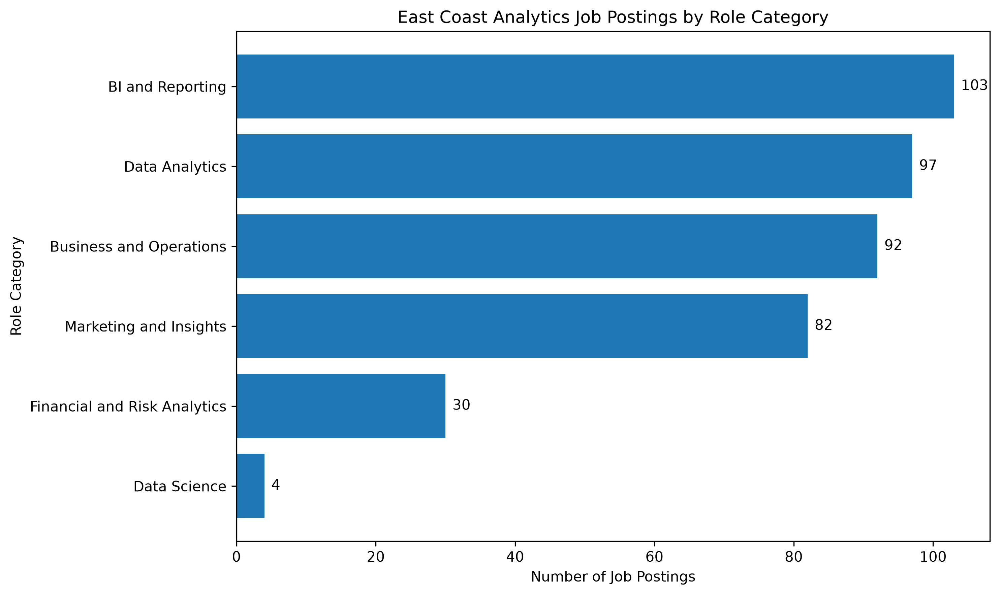
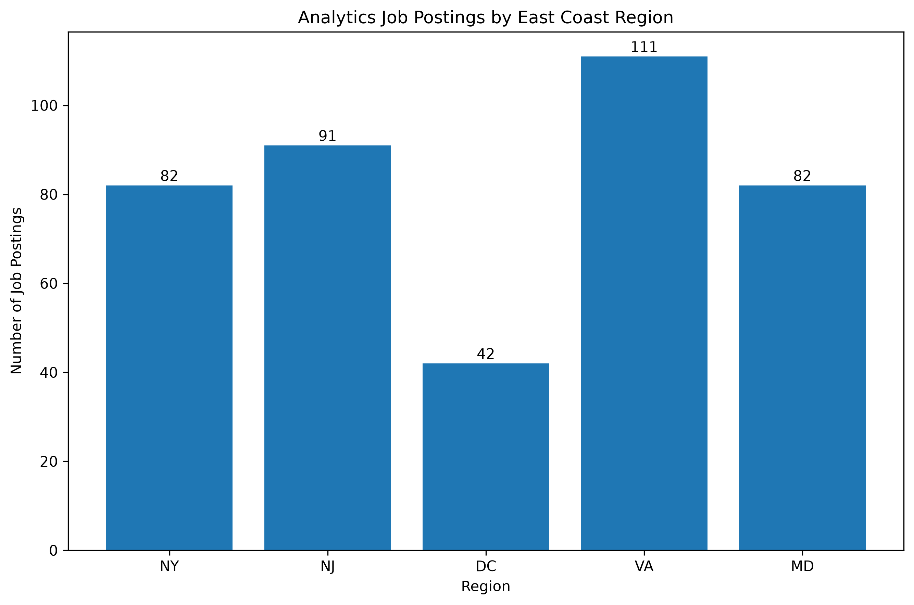
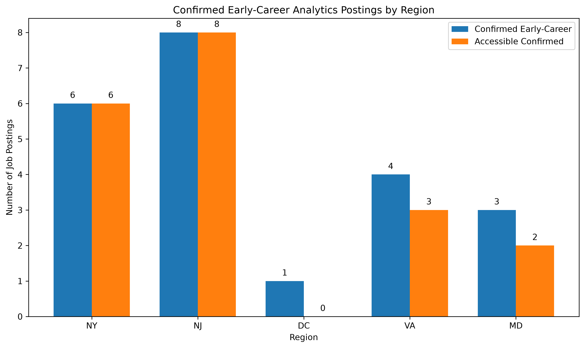
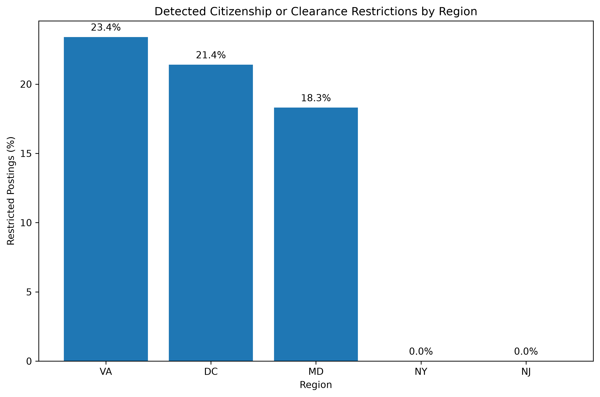
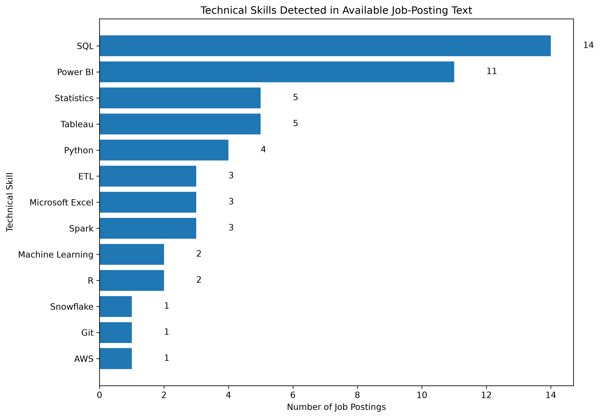
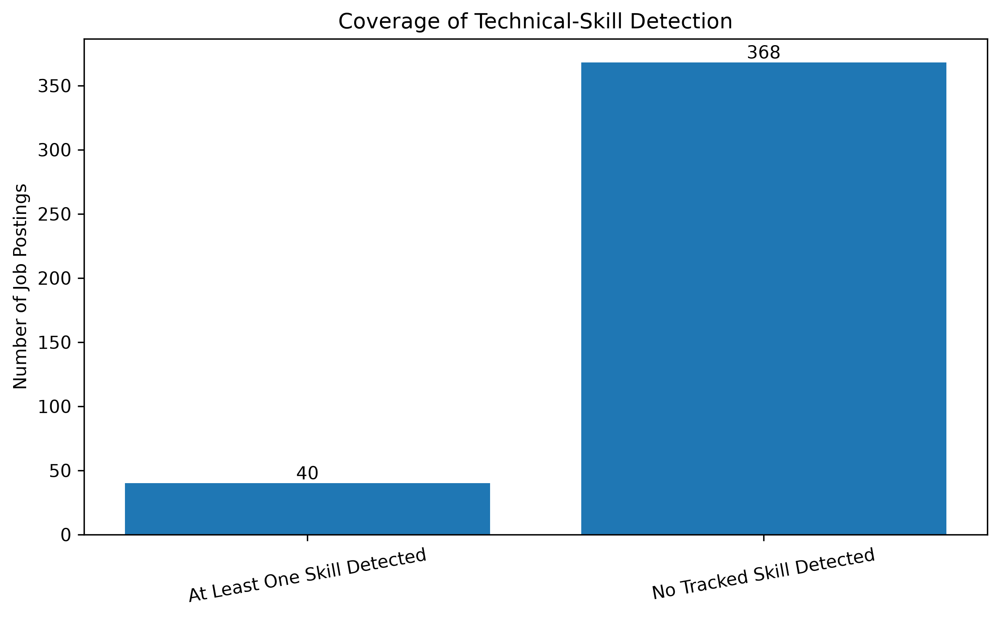
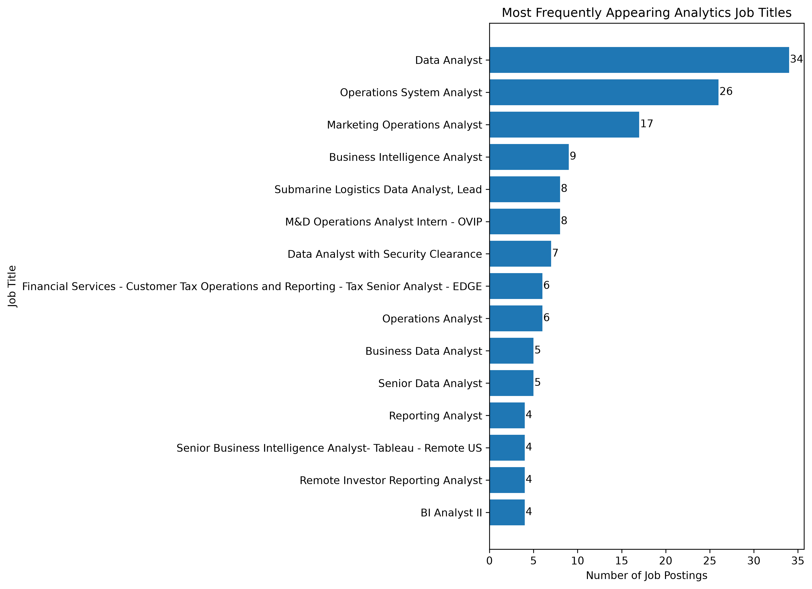
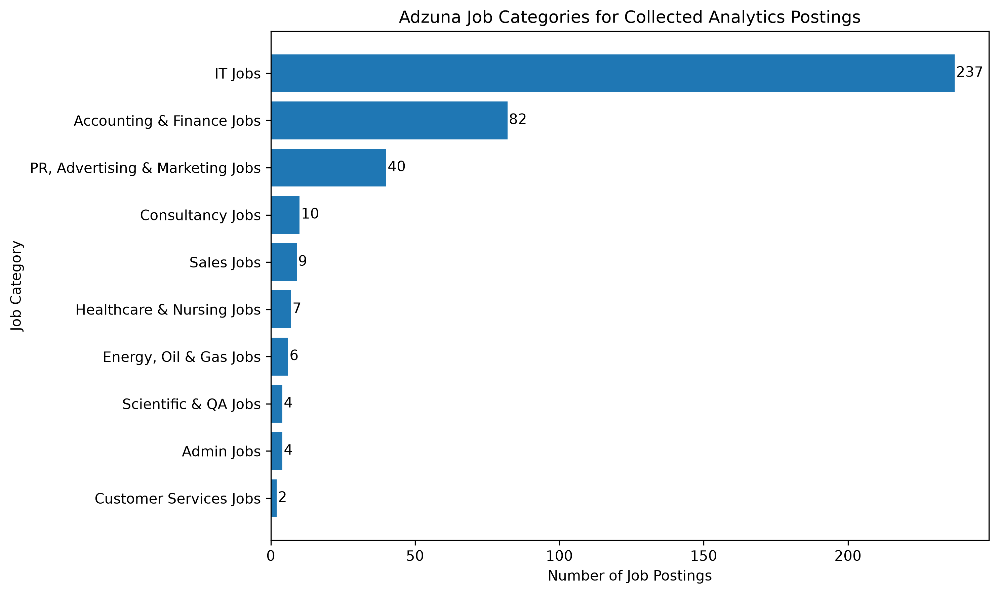

# East Coast Job Market Analysis

## Project Overview

This project analyzes data and analytics job postings across the U.S. East Coast, focusing on New York, New Jersey, Washington, D.C., Virginia, and Maryland.

The project examines regional differences, common analytics job categories, early-career accessibility, frequently appearing job titles, detected technical skills, and citizenship or security-clearance restrictions.

The results describe the postings collected through the selected search terms and API limits. They should not be interpreted as a complete measurement of the entire East Coast job market.

## Research Questions

1. Which locations had the most analytics-related postings in the collected sample?
2. Which analytics role categories appeared most frequently?
3. Which exact job titles appeared most often?
4. How did confirmed early-career opportunities differ across regions?
5. Where were citizenship or security-clearance restrictions most frequently detected?
6. Which technical skills were most frequently detected in the available job-posting text?

## Tools and Technologies

- Python
- pandas
- NumPy
- Matplotlib
- Jupyter Notebook
- Adzuna Job Search API
- Git and GitHub

## Data Collection

Job postings were collected through the Adzuna Job Search API.

The collection focused on five search terms:

- Data Analyst
- Business Intelligence Analyst
- Marketing Analyst
- Operations Analyst
- Reporting Analyst

The searches covered:

- New York
- New Jersey
- Washington, D.C.
- Virginia
- Maryland

The initial API collection returned **492 records**. After removing repeated job IDs, the final dataset contained **437 unique postings**.

The raw and processed CSV files are excluded from the public repository because they contain job descriptions and posting URLs. The collection and cleaning code is included so the analysis can be reproduced with valid API credentials.

## Methodology

1. Collected job postings through the Adzuna API.
2. Combined results from five search terms and five geographic areas.
3. Removed duplicate postings using job IDs.
4. Standardized locations and assigned each posting to one analysis region.
5. Categorized postings into broad analytics role groups.
6. Estimated career level using job-title keywords and detected experience requirements.
7. Flagged citizenship and security-clearance language using keyword matching.
8. Extracted selected technical skills from job titles and available description text.
9. Created summary tables and visualizations using pandas and Matplotlib.

## Key Findings

- **437 unique job postings** were included in the cleaned dataset.
- **408 postings** were classified as target analytics roles.
- **BI and Reporting** was the largest role category, followed by Data Analytics and Business and Operations.
- **Data Analyst** was the most frequently appearing exact job title.
- Virginia had the largest number of analytics postings in the collected sample, followed by New Jersey.
- **22 postings** were classified as confirmed early-career analytics opportunities.
- **19 confirmed early-career postings** had no detected citizenship or security-clearance restrictions.
- Citizenship or security-clearance restrictions were detected most frequently in Virginia, Washington, D.C., and Maryland.
- SQL and Power BI were the most frequently detected technical skills in the available job-posting text.

The absence of a detected restriction does not indicate visa sponsorship eligibility. It only means that the available posting text did not explicitly mention a citizenship or security-clearance requirement.

## Visualizations

### Analytics Roles by Category



### Analytics Job Postings by Region



### Confirmed Early-Career Postings by Region



### Detected Access Restrictions by Region



### Technical Skills Detected



### Technical-Skill Detection Coverage



### Most Common Job Titles



### Adzuna Job Categories



## Repository Structure

```text
east-coast-job-market-analysis/
├── data/
│   ├── raw/
│   └── processed/
├── notebooks/
│   ├── 01_data_cleaning.ipynb
│   └── 02_exploratory_analysis.ipynb
├── src/
│   ├── collect_jobs.py
│   └── test_api.py
├── sql/
├── visualizations/
├── .env.example
├── .gitignore
├── README.md
└── requirements.txt
```

## Reproducing the Project

### 1. Clone the repository

```bash
git clone https://github.com/yunglim/east-coast-job-market-analysis.git
cd east-coast-job-market-analysis
```

### 2. Create and activate a virtual environment

```bash
python3 -m venv .venv
source .venv/bin/activate
```

### 3. Install the required packages

```bash
pip install -r requirements.txt
```

### 4. Create a local environment file

Copy `.env.example` to `.env` and enter valid Adzuna API credentials.

```text
ADZUNA_APP_ID=your_app_id
ADZUNA_APP_KEY=your_app_key
```

The `.env` file is excluded from Git and should never be committed.

### 5. Collect job-posting data

```bash
python src/collect_jobs.py
```

### 6. Run the notebooks

Open JupyterLab and run the notebooks in order:

```bash
jupyter lab
```

1. `01_data_cleaning.ipynb`
2. `02_exploratory_analysis.ipynb`

## Project Status

✅ Initial project completed

- [x] Defined the topic and geographic scope
- [x] Selected and documented the data source
- [x] Collected job-posting data
- [x] Removed duplicate postings
- [x] Standardized locations and job categories
- [x] Classified career levels
- [x] Identified access restrictions
- [x] Conducted exploratory data analysis
- [x] Created and exported visualizations
- [x] Summarized key findings

### Possible Future Improvements

- Collect postings across multiple dates
- Add verified company-level industry information
- Expand salary analysis
- Add SQL-based analysis
- Build an interactive dashboard
- Compare skill demand over time
- Improve early-career classification using full job descriptions

## Limitations

- The dataset represents postings returned under selected search terms and API result limits rather than the complete East Coast job market.
- Each location and search-term combination returned a limited number of results, so regional counts are not complete market-size estimates.
- The API frequently returned shortened job-description excerpts.
- Early-career classifications were created using job-title keywords and detected experience requirements.
- Technical-skill counts represent detected keyword mentions rather than complete employer requirements.
- A posting without a detected citizenship or security-clearance restriction is not necessarily open to international applicants.
- The absence of a detected restriction does not indicate visa sponsorship.
- Adzuna categories are broad platform-defined job categories rather than verified company industries.
- Exact job titles were counted separately, so closely related titles may appear as different categories.
- The results reflect a single data-collection period and may change over time.
